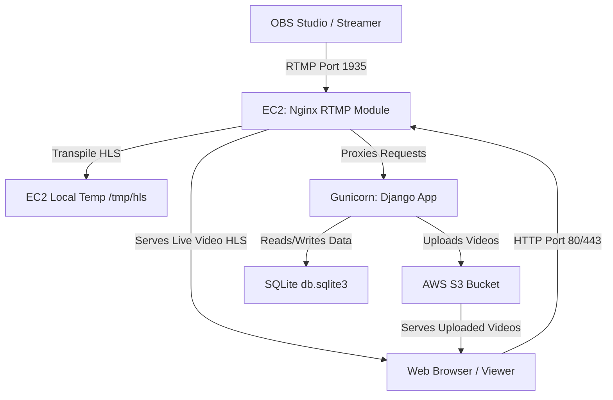

# AWS Free Tier Deployment Guide

This guide describes how to deploy the India Missions Portal application to AWS utilizing the **AWS Free Tier**. It includes step-by-step setup instructions for hosting the Django application on an EC2 instance, using AWS S3 for uploaded videos, and running the live streaming server (RTMP/HLS) on the EC2 instance for free.

---

## 1. Architecture Overview


---

## 2. AWS EC2 Setup (Free Hosting Server)
AWS provides a free virtual server (EC2) under the Free Tier for 12 months.

### Step 2.1: Launch the EC2 Instance
1. Log in to your **AWS Management Console**.
2. Search for **EC2** and click **Launch instance**.
3. **Name**: `missions-portal-prod`
4. **OS (AMI)**: Select **Ubuntu** (Choose **Ubuntu Server 24.04 LTS**, 64-bit x86 - marked *"Free tier eligible"*).
5. **Instance type**: Choose **`t2.micro`** (or **`t3.micro`** if `t2.micro` is unavailable in your region; both are free-tier eligible).
6. **Key pair**: Click **Create new key pair**. 
   - Key pair name: `missions-key`
   - Key pair type: `RSA`
   - Private key file format: `.pem`
   - Click **Create key pair** (this will download `missions-key.pem`. Move it to a secure location).
7. **Network settings**:
   - Check **Allow SSH traffic from** (Select **My IP** for maximum security, or **Anywhere** for quick access).
   - Check **Allow HTTP traffic from the internet**.
   - Check **Allow HTTPS traffic from the internet**.
8. **Storage**: Configure 1x 30 GB EBS General Purpose SSD (GP3) volume (up to 30 GB of storage is free on AWS Free Tier).
9. Click **Launch instance**.

### Step 2.2: Configure Network Security Groups (Allow OBS Stream)
To allow OBS Studio to stream to your server, you need to open the RTMP port (`1935`).
1. In the EC2 console, go to **Instances** and click on your running instance.
2. Under the **Security** tab, click on the **Security Groups** link.
3. Click **Edit inbound rules** and add the following rule:
   - **Type**: `Custom TCP`
   - **Port Range**: `1935`
   - **Source**: `Anywhere-IPv4` (`0.0.0.0/0`)
   - **Description**: `RTMP Ingest for OBS Live Stream`
4. Save the rules.

---

## 3. AWS S3 Setup (Free Uploaded Video Storage)
AWS S3 Free Tier includes 5 GB of standard storage for 12 months.

### Step 3.1: Create S3 Bucket
1. Open the AWS console, search for **S3**, and click **Create bucket**.
2. **Bucket name**: e.g., `potters-house-missions-media` (must be globally unique).
3. **Region**: Choose the region closest to you (e.g., `us-east-1` or `ap-south-1`).
4. **Object Ownership**: Select **ACLs enabled** (and keep **Bucket owner preferred** selected).
5. **Block Public Access settings for this bucket**:
   - *Uncheck* **Block all public access**.
   - *Check* the acknowledgment checkbox below it saying *"I acknowledge that the current settings may result in this bucket and the objects within it becoming public"*. (This is required so viewers can play the uploaded video files directly).
6. Click **Create bucket**.

### Step 3.2: Configure CORS (Cross-Origin Resource Sharing)
To allow your web application to request media from S3, you must configure CORS:
1. Click on your newly created bucket, go to the **Permissions** tab, scroll down to **Cross-origin resource sharing (CORS)**, and click **Edit**.
2. Paste the following JSON configuration and save:
   ```json
   [
       {
           "AllowedHeaders": ["*"],
           "AllowedMethods": ["GET", "HEAD"],
           "AllowedOrigins": ["*"],
           "ExposeHeaders": []
       }
   ]
   ```

### Step 3.3: Create IAM User (Access Keys for Django)
To give Django permission to write files into your S3 bucket, create an IAM user:
1. Search for **IAM** in the AWS console.
2. Go to **Users** -> **Create user**.
3. **User name**: `django-s3-uploader`
4. Click **Next** (do not enable AWS Console access).
5. On the **Set permissions** page, select **Attach policies directly**.
6. Search for and select the **`AmazonS3FullAccess`** policy (or create a custom policy restricting access to only your bucket).
7. Click **Next**, then **Create user**.
8. Select the created user, go to the **Security credentials** tab, scroll down to **Access keys**, and click **Create access key**.
9. Select **Command Line Interface (CLI)** or **Application running outside AWS**, accept the warning, click **Next**, and click **Create access key**.
10. **Save the Access Key ID and Secret Access Key immediately**. You will not be able to view the secret key again.

---

## 4. Install Dependencies on EC2
Log in to your Ubuntu instance using SSH:
```bash
ssh -i "missions-key.pem" ubuntu@<your-ec2-public-ip>
```

### Step 4.1: Install Python & System Packages
```bash
sudo apt update && sudo apt upgrade -y
sudo apt install python3-pip python3-venv git curl pkg-config -y
```

### Step 4.2: Install Nginx with RTMP Module
```bash
sudo apt install nginx libnginx-mod-rtmp -y
```

---

## 5. Deploy Django Code Base on EC2

### Step 5.1: Clone and Set Up Code
```bash
# Clone your repository (or upload your files using SFTP/SCP)
cd /home/ubuntu
# e.g., git clone <your-repo-url> church-app
# cd church-app

# Create a virtual environment
python3 -m venv venv
source venv/bin/activate

# Install requirements
pip install -r requirements.txt
```

### Step 5.2: Set Environment Variables
Create a file to house your environment variables securely:
```bash
nano /home/ubuntu/.env
```
Add the following content (update with your actual keys and bucket details):
```bash
export DJANGO_SECRET_KEY="your-production-secret-key-change-me"
export DJANGO_DEBUG="False"
export DJANGO_ALLOWED_HOSTS="<your-ec2-public-ip>,localhost,127.0.0.1"
export DJANGO_SITE_URL="http://<your-ec2-public-ip>"

# AWS S3 Settings
export AWS_ACCESS_KEY_ID="YOUR_AWS_ACCESS_KEY_ID"
export AWS_SECRET_ACCESS_KEY="YOUR_AWS_SECRET_ACCESS_KEY"
export AWS_STORAGE_BUCKET_NAME="potters-house-missions-media"
export AWS_S3_REGION_NAME="us-east-1"
```
Make sure these variables are loaded automatically when you log in or start the app:
```bash
echo "source /home/ubuntu/.env" >> /home/ubuntu/.bashrc
source /home/ubuntu/.env
```

### Step 5.3: Run Database Migrations & Collect Static
```bash
# Run migrations to set up SQLite database
python manage.py migrate

# Collect static files into staticfiles/ directory
python manage.py collectstatic --noinput

# Create a superuser to access the admin portal
python manage.py createsuperuser
```

---

## 6. Configure System Services

### Step 6.1: Set Up Gunicorn (Django WSGI Server)
Create a system service for Gunicorn so it runs continuously in the background:
```bash
sudo nano /etc/systemd/system/gunicorn.service
```
Paste the following configuration:
```ini
[Unit]
Description=gunicorn daemon
After=network.target

[Service]
User=ubuntu
WorkingDirectory=/home/ubuntu/church-app
EnvironmentFile=/home/ubuntu/.env
ExecStart=/home/ubuntu/venv/bin/gunicorn \
          --access-logfile - \
          --workers 3 \
          --bind 127.0.0.1:8000 \
          church_project.wsgi:application

[Install]
WantedBy=multi-user.target
```
Enable and start the service:
```bash
sudo systemctl daemon-reload
sudo systemctl start gunicorn
sudo systemctl enable gunicorn
```
Verify Gunicorn is running:
```bash
sudo systemctl status gunicorn
```

### Step 6.2: Configure Nginx (RTMP + Web Proxy)
We will route web requests to Django, and setup the RTMP stream receiver.

1. Create directory for HLS temporary video fragments (served for live viewers):
```bash
sudo mkdir -p /var/www/hls
sudo chown -R www-data:www-data /var/www/hls
```

2. Replace the Nginx default configuration. Backup the old file first:
```bash
sudo mv /etc/nginx/nginx.conf /etc/nginx/nginx.conf.bak
sudo nano /etc/nginx/nginx.conf
```
Paste this complete, optimized Nginx config:
```nginx
user www-data;
worker_processes auto;
pid /run/nginx.pid;
include /etc/nginx/modules-enabled/*.conf;

events {
    worker_connections 1024;
}

http {
    sendfile on;
    tcp_nopush on;
    tcp_nodelay on;
    keepalive_timeout 65;
    types_hash_max_size 2048;

    include /etc/nginx/mime.types;
    default_type application/octet-stream;

    # Logging Settings
    access_log /var/log/nginx/access.log;
    error_log /var/log/nginx/error.log;

    # Gzip Settings
    gzip on;

    # HTTP Server Configuration
    server {
        listen 80;
        server_name _; # Adjust this to your domain if you have one

        # Serve static files directly
        location /static/ {
            alias /home/ubuntu/church-app/staticfiles/;
        }

        # Serve local media files (if any are stored locally)
        location /media/ {
            alias /home/ubuntu/church-app/media/;
        }

        # Play HLS Live Streams directly from fast local disk
        location /hls {
            types {
                application/vnd.apple.mpegurl m3u8;
                video/mp2t ts;
            }
            root /var/www;
            add_header Cache-Control "no-cache, no-store, must-revalidate, pre-check=0, post-check=0";
            add_header Pragma "no-cache";
            add_header Expires "0";
            add_header Access-Control-Allow-Origin *;
        }

        # Proxy web requests to Gunicorn running Django
        location / {
            proxy_pass http://127.0.0.1:8000;
            proxy_set_header Host $host;
            proxy_set_header X-Real-IP $remote_addr;
            proxy_set_header X-Forwarded-For $proxy_add_x_forwarded_for;
            proxy_set_header X-Forwarded-Proto $scheme;
        }
    }
}

rtmp {
    server {
        listen 1935;
        chunk_size 4096;

        application live {
            live on;
            record off;

            # Enable HLS stream transpiling
            hls on;
            hls_path /var/www/hls;
            hls_fragment 3;
            hls_playlist_length 60;
            hls_cleanup on;

            # Notify Django when OBS starts/stops streaming
            on_publish http://127.0.0.1:8000/api/livestream/notify/?action=start;
            on_publish_done http://127.0.0.1:8000/api/livestream/notify/?action=stop;
        }
    }
}
```

3. Test and restart Nginx:
```bash
sudo nginx -t
sudo systemctl restart nginx
sudo systemctl enable nginx
```

---

## 7. Connecting OBS Studio to Stream
Now that your server is live, a Pastor can broadcast:

1. In the Django admin panel (`http://<your-ec2-ip>/admin`), create or select a **Pastor** record and copy their **Stream Key** (e.g., `pastor-john-stream`).
2. Open **OBS Studio** on your computer.
3. Go to **Settings** -> **Stream**.
4. **Service**: Select `Custom...`
5. **Server**: `rtmp://<your-ec2-public-ip>/live`
6. **Stream Key**: `pastor-john-stream` (use the stream key for the pastor).
7. Under **Settings** -> **Output** -> **Streaming**:
   - Set **Rate Control**: `CBR`
   - Set **Bitrate**: `1500 Kbps` to `2500 Kbps` (ideal for low-end networks and free tier EC2 network speeds).
   - Set **Keyframe Interval**: `3` seconds.
8. Click **Start Streaming**!

---

## 8. Troubleshooting
* **Gunicorn logs**: Check if Django crashed:
  ```bash
  sudo journalctl -u gunicorn --no-pager | tail -n 50
  ```
* **Nginx logs**: Check HTTP router issues:
  ```bash
  sudo tail -n 50 /var/log/nginx/error.log
  ```
* **Permission denied on HLS output**: Ensure `/var/www/hls` belongs to `www-data`:
  ```bash
  sudo chown -R www-data:www-data /var/www/hls
  ```
